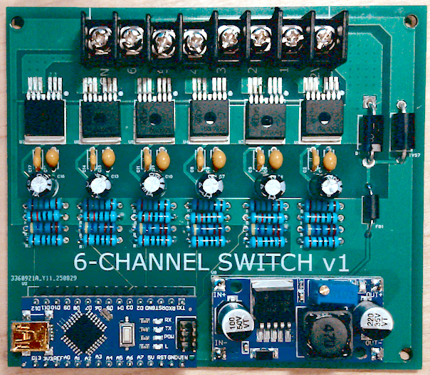

# Neoteric Glow Plug Controller

An intelligent Arduino-based glow plug controller for 6-cylinder diesel engines featuring individual plug monitoring, temperature-adaptive timing, and comprehensive fault indication.



## Features

### **Intelligent Heating Control**
- **Two-Phase Heating**: 5 seconds at 100% power, then reduced to 60% 
- **Temperature-Adaptive Duration**: Cold engines (15s total), Hot engines (8s total)
- **Staggered Startup**: 1-second delay between plugs to reduce electrical load
- **Individual Control**: Each glow plug operates independently

### **Advanced Monitoring**
- **Real-Time Current Sensing**: Individual current monitoring per cylinder using BTS50010 high-side switches
- **Temperature Estimation**: Calculates glow plug temperature from current draw
- **Fault Detection**: Over/undercurrent protection with automatic plug disable
- **Voltage Divider Input**: 4.7kΩ/1.5kΩ divider for Arduino ADC compatibility

### **Fault Indication**
- **LED Blinking Codes**: Visual indication of failed plugs (1 blink = plug 1, 2 blinks = plug 2, etc.)
- **Priority System**: Shows lowest numbered fault first when multiple faults exist
- **Non-Interfering**: Fault indication doesn't disrupt normal operation

## Schematic

[v1 Schematic is here](schematic-v1.pdf)

## Hardware Requirements

### **Microcontroller**
- Arduino-compatible board (Uno, Nano, etc.)
- 6 PWM-capable output pins
- 6 analog input pins

### **Power Switching**
- 6x BTS50010 high-side switches (or equivalent)
- Rated for 15A+ continuous current per channel

### **Current Sensing**
- Voltage divider: 4.7kΩ (R1) to Arduino input, 1.5kΩ (R2) to ground
- Connected to BTS50010 current sense outputs

### **Connections**
```
Arduino Pins:
- PWM Outputs: 3, 5, 6, 9, 10, 11 (to BTS50010 control inputs)
- Analog Inputs: A0, A1, A2, A3, A4, A5 (from voltage dividers)
- Built-in LED: Fault indication
```

## Operation Sequence

### **1. Boot Sequence (1 second)**
- Initialize all outputs to OFF
- Initialize inputs for current monitoring
- Prepare for temperature measurement

### **2. Temperature Measurement (0.25 seconds)**
- Simultaneously energize all plugs at 10% duty cycle for 200ms
- Measure current and estimate initial temperature for each plug
- Classify as "hot" (≥200°C) or "cold" (<200°C)
- Set appropriate heating duration per plug

### **3. Staggered Startup**
- Plug 1 starts immediately
- Plug 2 starts after 1 second
- Plug 3 starts after 2 seconds
- Continue pattern for remaining plugs

### **4. Two-Phase Heating**
**Phase 1 - Full Power (5 seconds):**
- 100% PWM duty cycle
- Maximum current draw per plug
- Rapid initial heating

**Phase 2 - Reduced Power (3-10 seconds):**
- 60% PWM duty cycle  
- Reduced power consumption
- Sustained heating to operating temperature

### **5. Completion**
- All plugs shut off individually based on their timing
- Enter low-power mode
- Continue fault monitoring and indication


## License

MIT License - See main project LICENSE file for details.

© 2025 Chris Tacke