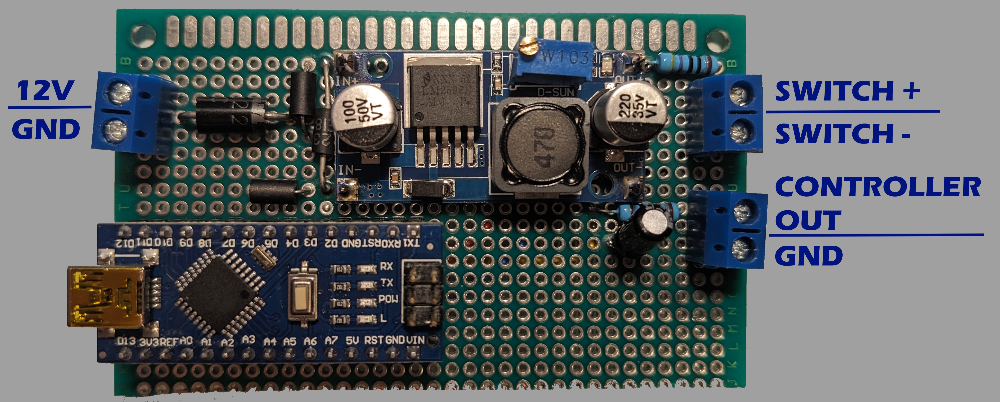

# Transfer Case Switch Converter



This Arduino app reads the position of an in-cab transfer case switch and sends a quanized 0-5V analog signal out to the transfer case controller.

The default implementation is designed to use a Dorman 601-604 switch and control a (mid 2010's) Ford transfer case

## Theroy of Operation

The board takes in nominal 12V automotive voltage.  It regulates that down to 5V and includes reverse polarity protection.

### Switch Input
5V is then output to a voltage divider that uses a 470-ohm pull-up as R1 and the transfer case switch as R2, so the `SWITCH +` terminal is powered and `SWITCH -` is a ground.

```
5V >----[R1 470-ohm]----+----[SWITCH]----< GND
                        |
                        |
                     Arduino A0
```

The output if this voltage divider goes in to an Arduino on A0.  A lookup table is used to determine which switch position corresponds to the voltage read.

| position | `R2` resistance | voltage to `A0` |
|-|-|-|
| 4L | 130 | 1.083 |
| 4H | 270 | 1.824 |
| 2H | 620 | 2.844 |

### Controller Output

The Arduino application then uses a lookup table to determine an output voltage level to set on `D3` to send to the controller.

| gear | input voltage |
| - | - |
| 4L | 1.5V |
| 2H | 2V |
| 4H | 3V | 

Arduinos don't have a DAC, so we use a PWM and an RLC filter to create a desired output voltage.  This design uses a 100-ohm resistor, a 100mH inductor, and a 47uF capacitor.  This should give a resonant frequency around 70Hz and a 20dB attenuation.

The RLC filter has a voltage drop, so the theoretical PWM voltage does not directly map to the output voltage.  The code has a "calibration" value to scale for that.

```
D3 >----[1kohm]----[100mH]---+----< Filtered Output
                      |
                    [47uF]
                      |
                   (Ground)
```

## Wiring

Assuming "up" is with the power supply board and the top, and the Arduino at the lower left, the wiring is as follows

|Left terminals||
|-|-|
|Top|  12V DC|
|Bottom| Chassis Ground|

|Right upper terminals||
|-|-|
|Top|Switch Voltage|
|Bottom| Chassis Ground|

|Right lower terminals||
|-|-|
|Top|Controller output Voltage|
|Bottom|Chassis Ground|

The chassis grounds for the switch and controller are optional if the switch or controller are grounded elsewhere.
