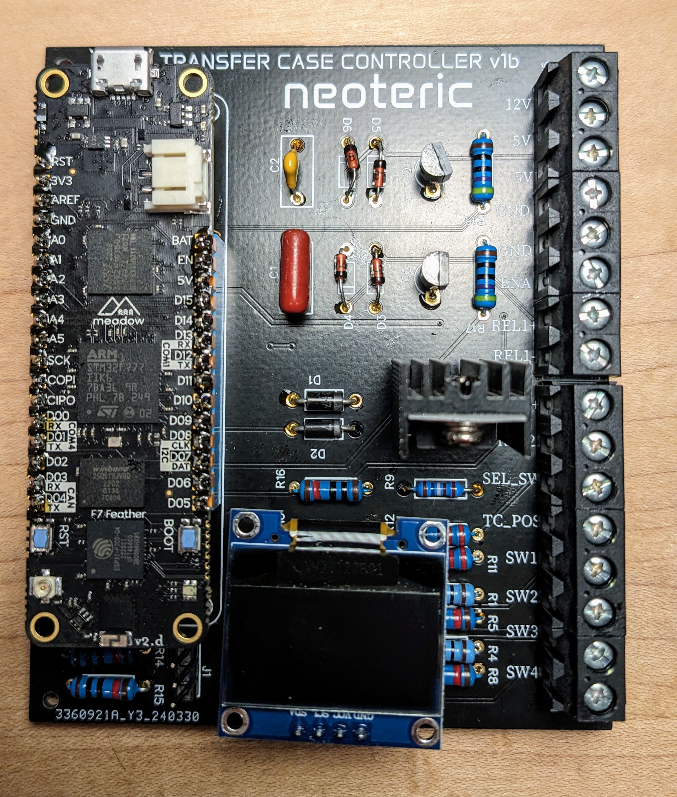

# Neoteric Transfer Case support

An open-source hardware and software controller for automotive transfer cases.

Software is written in CE using the Meadow software stack and currently targets the F7 Feather microcontroller hardware.

Current version supports the following transfer cases:

- Borg Warner 4419
- Magna Power 3023NQH

## Previous Hardware

## Current Hardware

The current controller is the `NTCv1c`.  

## Schematic

The schematic is available in [PDF Format](doc/v1b/schematic_NTCC_v1b.pdf)

## Pinout

### `U1`  
Connector for a Wilderness Labs Meadow F7 Feather v2

### `U3` 
Screw Terminals

| Pin | Function |
| --- | --- |
| 1 | `12V` IN |
| 2 | `5V` IN |
| 3 | `5V` OUT |
| 4 | `GND` |
| 5 | `GND` |
| 6 | `ENA` : Must be grounded to enable controller |
| 7 | `REL1+` : 12V to coil of shift motor relay 1 |
| 8 | `REL1-` : Ground to coil of shift motor relay 1 |
| 9 | `REL2+` : 12V to coil of shift motor relay 2 |
| 10 | `REL2-` : Ground to coil of shift motor relay 2 |
| 11 | `SEL_SW` Voltage output to 3-position gear selector switch |
| 12 | `TC_POS` 5V Input for transfer case position sensor (on MP3023NQH only) |
| 13 | `SW1` 5V input for transfer case position switch 1 (on BW4419 only) |
| 14 | `SW2` 5V input for transfer case position switch 2 (on BW4419 only) |
| 15 | `SW3` 5V input for transfer case position switch 3 (on BW4419 only) |
| 16 | `SW4` 5V input for transfer case position switch 4 (on BW4419 only) |
| 17 | `HUB` Hub Lock Input - drives to ground to lock hubs when 4WD is selected |
| 18 | `SW4` TCASE Unlock Output - Output 12V when shift is in-progress (on BW4419 only) |

### `U4` 
Debug Display.  Connect an optional SSD1306 Display module for debugging.

| Pin | Function |
| --- | --- |
| 1 | 5V |
| 2 | GND |
| 3 | SDA |
| 4 | SCL |

### `J1`
Transfer Case Selector.  Use a jumper to select the connected transfer case.  Up selects an MP3023NQH, down selects a BW4419.

| Pin | Function |
| --- | --- |
| 1 | MP3023 |
| 2 | Selector |
| 3 | BW4419 |

## Notes/Work Items for next Version

Below is a running list of tasks/features that I hope to include in a next version (no scheduled date)

- Add an on-board 12V->5V Automotive power supply
- Add on-board relays for shift motor driving 
- Add 2 more ground terminal connectors
- Add a jumper for disconnecting 5V from the 12V supply (power from USB)
- Add silkscreen for t-case selection jumper
- Add a jumper to pull the ENA safety interlock low
- Add a jumper or expander to allow software read of hardware revision 
- Add CAN bus support
- Add jumper-optional sleep/wake on switched ACC power
- Add interlock disable (ground) jumper
- Add schottky diode to 12Vin and 5V out for reverse-polarity protection
- Add TVS diodes for transient protection